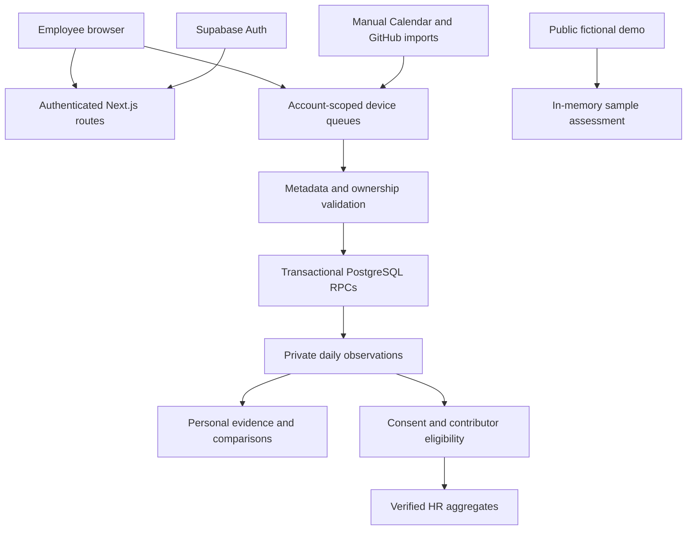

# AI Wellness Twin

System Documentation | 7 October 2026 | Application version 0.1.0

Code reviewed: `c014d5f` (Prepare public presentation demo and reviewed organization setup).

This is the October 7 architecture snapshot. For the October 8 database upgrade,
verified Google access, ingestion results and follow-up UI fixes, see
[current engineering status](ENGINEERING_STATUS.md).

Website: https://ai-wellness-twin.vercel.app

Public presentation: https://ai-wellness-twin.vercel.app/demo

## 1. Purpose and scope

AI Wellness Twin helps employees understand changes in their recorded work patterns. It compares each employee with their own earlier observations and provides descriptive feedback about working time, meetings, breaks and after-hours activity. Eligible HR users receive restricted group aggregates for verified organizations.

This is an application under development with a public sample-data demonstration. Its comparisons and pattern index are not medical diagnoses, validated burnout measures, productivity ratings or employee rankings. The assessment and recommendations use deterministic rules; this implementation does not call a generative AI model to diagnose employees.

This document covers the repository, user workflows, ingestion, privacy boundaries and operational requirements. Implemented code, local tests and verified production behavior are separate evidence levels. Prepared migrations do not establish that the deployed database has been upgraded.

| Area | Current state |
| --- | --- |
| Public demo | Available without an account; fictional observations and no live ingestion. |
| Real authentication | Supabase email/password and Google OAuth implemented; successful owner access remains unverified. |
| Recovery email | Request/reset forms implemented; 7 October live request returned recovery unavailable. Delivery unresolved. |
| Cloud ingestion/privacy | Implemented with locally tested PostgreSQL migrations; live application and authenticated ingestion unverified. |
| Organization onboarding | Personal-account setup requests implemented; administrator review and membership provisioning separate. |
| Integrations | Manual Calendar and public GitHub imports implemented; linked tool labels do not prove activity streams. |
| Surveys/alerts | Survey scoring, clinical measures, persona-driven behavior and scheduled alert delivery not implemented. |

Employees inspect their own evidence and recommendations. HR users inspect eligible group trends. Trusted administrators configure providers, apply migrations, review organizations and provision memberships. Presenters use the public fictional demo.

## 2. Requirements and boundaries

| Requirement | Implementation boundary |
| --- | --- |
| Personal comparison | Use the employee's own valid observations; preserve unknown measurements. |
| Evidence before interpretation | Require per-metric baseline coverage and explain unavailable comparisons. |
| Private access | Server authentication and database ownership policies. |
| Restricted HR release | Verified role/membership, consent, baseline eligibility and three contributors per metric. |
| Metadata-only ingestion | Allowlisted fields, bounded requests and rejection of unexpected content fields. |
| Reliable retries | Stable event IDs, transactional deduplication and account-scoped queues. |
| Honest integration status | Distinguish linked identities, pending uploads, recorded data and missing collectors. |
| Safe demonstrations | Synthetic source labels; public controls change only in-memory samples. |

The included workstation tracker observes interaction and visibility within the application page. It does not monitor the entire operating system or read keystroke text, source code, prompts or message bodies. Time away from the page is not proof of time away from work.

## 3. Technology and repository

Versions are declared dependencies in `package.json`, not every installed transitive dependency.

| Layer | Technology |
| --- | --- |
| Web application | Next.js `^16.3.8`, App Router |
| UI | React/React DOM `19.2.8`, TypeScript `^5` |
| Styling/icons | Tailwind CSS `^4`, Lucide React |
| Auth/database | Supabase SSR `^0.12.5`, Supabase JS `^2.112.4`, PostgreSQL |
| Device queues | IndexedDB; explicit memory-only fallback on storage failure |
| Testing | Node test runner, PGlite, fake-indexeddb |
| Hosting | Public website on Vercel |

Use Node.js 22 or newer. Before editing Next.js code, read relevant installed guides under `node_modules/next/dist/docs/`, as required by `AGENTS.md`.

| Directory | Responsibility |
| --- | --- |
| `src/app` | Pages, layouts and HTTP handlers |
| `src/components` | Shared UI, assessments, public demo and organization form |
| `src/lib/supabase` | Authentication, configuration, schema and migrations |
| `src/lib/telemetry` | Tracker, validators, queues, acknowledgements and cloud ingestion |
| `src/lib/integrations` | Provider authorization, normalization and manual imports |
| `src/lib/wellbeing` | Evidence, baseline, comparisons, recommendations and HR workspace |
| `src/lib/settings` | Account preferences and schedule classification |
| `src/lib/organizations` | Setup requests and review state |
| `tests`, `docs` | Regression coverage and current documentation |
| `.data` | Ignored local demo/runtime files; never public documentation |

## 4. Architecture



The server verifies identity; browser identity is a display cache. Real cloud ingestion uses authenticated PostgreSQL functions and has no local-file fallback on database failure. Development demo telemetry uses a separate optional local backend.

The public demo neither starts real collectors nor reads/writes account observations, consent, organizations or provider links. Its HR view illustrates suppression with fictional averages. Real HR uses database policy and aggregate functions.

## 5. Routes and user guide

| Route | Purpose/access |
| --- | --- |
| `/`, `/demo` | Public introduction and fictional demonstration |
| `/register`, `/login` | Personal employee signup and Supabase/Google sign-in |
| `/forgot-password`, `/reset-password` | Recovery request and verified-session password update |
| `/register-company` | Organization setup request from a verified personal account |
| `/dashboard` | Protected personal overview and evidence |
| `/dashboard/patterns` | Personal work-pattern view |
| `/dashboard/assessment` | Evidence/private reflection; survey scoring unavailable |
| `/dashboard/recommendations`, `/dashboard/reports` | Personal suggestions/reporting views |
| `/dashboard/integrations` | Provider links, manual imports and data status |
| `/settings` | Protected preferences, collection and group-sharing controls |
| `/hr`, `/hr/teams`, `/hr/trends` | HR views; real data needs trusted organization provisioning |

### Employee onboarding

1. Register with name, email and matching password; confirm email when required, then sign in. Configured Google sign-in is an alternative.
2. Save account-specific timezone, workdays, work hours and collection preferences in Settings.
3. Review capture controls and sharing. Group sharing starts disabled for verified memberships.
4. Keep the dashboard open for page-based collection and inspect live/queue notices.
5. Import supported sources through Integrations; authorization alone does not create observations.
6. Read baseline coverage and evidence before interpreting changes. A new account has no established baseline.

If an email already exists, recover/sign into that account. Another signup does not replace its password. A recovery request is complete only when the service succeeds; the latest deployed request failed. Google sessions can expire and require restarting from the application's login page.

### Organization and HR onboarding

1. A verified personal account submits company name, domain and size at `/register-company`.
2. The database derives the applicant/confirmed email. Identical retries return the committed receipt; one pending request per account.
3. An administrator independently verifies the business and representative's authority.
4. The administrator provisions the organization, reviews the request and separately assigns roles, active memberships and cohorts.
5. Employees decide whether eligible measurements may contribute to aggregates.
6. HR sees metrics only when tenant, consent and evidence requirements are met.

Submitting or approving a request does not automatically grant HR access or membership. Browser team/invitation registries are prototype state, not trusted production authority.

### Settings and reflections

Preferences are account-scoped in this browser. Legacy shared settings are preserved rather than adopted; invalid/unreadable settings pause collection. Schedule rules support IANA timezones, selected workdays, overnight shifts and daylight saving. Changes affect subsequent browser intervals; reimport Calendar dates to reclassify them.

Private weekly reflections stay in account-scoped browser storage, do not change the index and do not enter HR aggregates. Browser cache export/clearing does not export/delete all cloud data. Unlinking cancels pending imports but preserves earlier cloud history.

## 6. Personal metrics and evidence

| Metric | Unit | Interpretation limit |
| --- | --- | --- |
| `workingHours` | Hours per UTC date | Recorded intervals; partial page coverage is not total work time. |
| `meetingLoad` | Hours per UTC date | Scheduled meeting duration, not confirmed attendance. |
| `breakFrequency` | Observed event count | Missing observations are not zero breaks. |
| `afterHoursActivity` | Minutes per UTC date | Recorded time outside configured work hours when enabled. |

`observedMetrics` marks actual measurements. Numeric placeholders without an observed marker cannot establish a baseline. Records may retain source contributions, measured tool durations, GitHub event counts and revisions.

### Comparison windows

Exclude today, future dates, duplicate dates and invalid values. The comparison window is the seven closed UTC dates immediately before today. For each metric, select the most recent 28 valid earlier observed dates before that window, within the past 90 closed UTC dates. Average the baseline and available recent observations; expose only supported per-metric comparisons. Windows never overlap.

A complete overall index needs 28 earlier observed dates plus all four metrics on seven recent dates: at least 35 closed dates with required coverage. Twenty-eight days since signup alone are insufficient. Per-metric baselines can cover different dates when measurements are missing.

### Changes and descriptive index

For a nonzero baseline: `percentage change = (recent average - baseline average) / baseline average * 100`. A change of at least 20% in either direction is meaningful. An increase from zero has an undefined percentage and is described qualitatively; zero to zero is 0%.

An overall index requires four comparable metrics, observations on all seven recent dates for each, and defined percentage changes. It starts at 100 and subtracts weighted meaningful deviations: increased working hours (30%), meetings (20%), decreased breaks (20%) and increased after-hours activity (30%). Each percentage magnitude is capped at 100 before weighting; the result is rounded and bounded below by zero.

| Status | Condition |
| --- | --- |
| Building | No comparable metrics |
| Partial | Some comparisons, insufficient complete-index evidence |
| Stable | Complete index at least 80 |
| Watch | Complete index 60 to 79 |
| Attention | Complete index below 60 |

These are recording-rule labels, not clinical severity levels. Recommendations describe supported directions and limitations rather than inferring exhaustion, detachment or professional efficacy.

## 7. Data ingestion and reliability

The dashboard loads authenticated cloud history before assessment and collection. Input events update presence rather than sending one packet per movement. Visibility, inactivity, pauses and identity changes constrain collection. Completed intervals enter account-scoped device queues.

Timestamps are interval end times. Durations retain precision, split across UTC midnight and union overlapping intervals. Work schedules classify after-hours activity in the configured timezone; storage/comparison buckets remain UTC.

### Heartbeat contract

`POST /api/telemetry/heartbeat` needs an employee session, same-origin request and employee-owned payload. `organizationId` must be the personal namespace `personal:<authenticated-user-id>`, not a client-selected organization membership.

```json
{
  "eventId": "opaque-unique-event-id",
  "employeeId": "authenticated-user-id",
  "organizationId": "personal:authenticated-user-id",
  "timestamp": "2026-10-07T02:00:45.000Z",
  "activeSeconds": 45,
  "meetingMinutes": 0,
  "isBreak": false,
  "isEvening": false,
  "afterHoursObserved": true,
  "source": "workstation"
}
```

Use real verified identity/current time in a collector. Preserve event ID and metadata exactly on retries.

| Validation | Rule |
| --- | --- |
| Body | Maximum 16 KiB JSON; unexpected fields rejected |
| IDs | Allowlisted format, maximum 128 characters; session ownership enforced |
| Timestamp | Valid ISO with offset; within 35-day window, at most five minutes ahead |
| Active interval | Finite 0 to 300 seconds |
| Meeting duration | Finite 0 to 1440 minutes; Calendar only |
| Calendar evidence | No active workstation seconds or break claim |
| Observation | Must contain duration or a break; no invented time |
| After-hours disabled | `afterHoursObserved: false` cannot accompany `isEvening: true`; stays unknown |

Allowed source names include workstation, ide, calendar, presence, vscode, gemini, chatgpt, claude, figma, slack, discord and github. An accepted name does not prove a shipped collector.

`/api/telemetry/calendar-webhook` accepts normalized Calendar packets under these authenticated guards. Native provider notifications require verified subscriptions/fetch adapters that are not implemented.

### Daily source snapshots

`POST /api/telemetry/source-snapshots` accepts `{ snapshots, capturedAt }` for cloud employees, bounded to 36 Calendar/GitHub daily snapshots with validated capture/source/ownership. Calendar can observe scheduled meeting load and optional after-hours load, never work hours or breaks. GitHub supplies public event counts without duration-based observed metrics.

Corrections replace a source's snapshot without erasing other sources. Older captures cannot overwrite newer observations. Complete Calendar coverage includes empty days to clear cancelled meetings on reimport. Calendar-range coverage is not proof of complete workday observation.

### Queue and acknowledgement guarantees

- Account-scoped IndexedDB persists packets/imports before upload when available. Atomic claims and leases coordinate tabs; heartbeat leases expire after 60 seconds.
- Database transactions deduplicate IDs, union intervals, materialize daily observations and serialize uploads with per-employee locks. Reusing an ID with different metadata conflicts.
- Failed transactions are not acknowledged. Only validated employee-owned snapshots covering required affected dates update the cache/remove queued data.
- Transient/auth failures retain retryable data. Rejected, expired and cancelled records remain for review; fresh observations can still proceed.
- Minimal receipts/hashes retain replay evidence for 35 days without retaining uploaded device packets. Browser cleanup runs when queues are processed.
- Storage failures show memory-only status; those observations require the page to remain open and cannot survive closing it.

Derived daily cloud history remains after the raw receipt/interval replay window. Retention, backup and deletion policies for that history remain operational requirements. Browser clearing is not cloud deletion.

## 8. Integration capability matrix

| Source | Implemented | Limitation/remaining work |
| --- | --- | --- |
| Workstation page | Page activity, break events, work-schedule classification | Not an operating-system monitor |
| Google Calendar | Authorization and manual scheduled-block imports | No continuous subscriptions/background token refresh |
| GitHub | Authorization and public event-count imports | No measured coding hours or private activity completeness |
| Slack, Discord | Provider authorization paths and link UI | Automatic activity collectors incomplete |
| VS Code, Figma | Tool labels and normalized metadata contracts | No verified shipped native activity collectors |
| ChatGPT, Gemini, Claude | Tool labels and normalized metadata contracts | No automatic consultation/prompt collectors |
| Microsoft/Outlook | Metric source label exists | No completed Outlook integration flow documented here |

OAuth state is encrypted, expires after ten minutes and is bound to employee/origin. GitHub uses S256 PKCE; secrets stay server-side. A popup closing is not proof of authorization or ingestion. Queue retries upload existing observations; they do not fetch new provider data or refresh tokens.

## 9. Authentication and privacy

Supabase verifies real accounts. Roles derive from administrator-managed `app_metadata`; real HR access additionally needs active organization membership and database enforcement. Editable profile metadata/local caches cannot grant authority. Failed real login does not fall back to a demo.

Protected routes/APIs reject anonymous access. Ingestion checks employee role, ownership and origin. Reverse proxies explicitly configure the public origin; forwarded hosts are not automatically trusted.

### HR release rules

Each released metric needs three consenting eligible contributors in a verified group. Each contributor needs 28 valid earlier observed dates for that metric within the preceding 90 closed UTC dates. Unknown, invalid, stale, future and demo values do not qualify. Valid measured zero can qualify; placeholders cannot.

Insufficient evidence withholds that metric rather than substituting zero/revealing personal measurements. Eligibility is metric-specific. HR measurement output excludes individual identifiers. A minimum contributor threshold alone is not proof against every inference attack; live privacy review remains necessary.

| Data | Storage/boundary |
| --- | --- |
| Identity/credentials | Supabase Auth; UI identity cache is not authority |
| Daily observations | PostgreSQL ownership policies/RPCs |
| Membership/consent | Trusted database provisioning/restricted updates |
| HR output | Tenant-aware database aggregate function |
| Pending imports/packets | Account-scoped IndexedDB or explicit memory-only fallback |
| Preferences/link labels/reflections | Account-scoped browser storage, not organization authority |
| Public demo | Fictional in-memory samples |
| Development demo | Ignored local telemetry file |

The allowlist rejects unexpected raw content fields. This is an application boundary, not regulatory certification or an audit of every future external collector.

## 10. Database reference

The base schema restricts access until privacy migrations are applied. Apply upgrades through a privileged administrative connection, never a browser public key.

| Table/store | Purpose |
| --- | --- |
| `public.profiles` | Auth-linked identity and server-managed role |
| `public.organizations` | Trusted organizations |
| `public.organization_members` | Active role/membership and sharing consent |
| `public.hr_groups`, `public.hr_group_members` | Verified cohorts and their members |
| `public.employee_daily_metrics` | Materialized employee/date observations with evidence |
| `public.employee_metric_sources` | Daily source contributions/capture information |
| `public.organization_setup_requests` | Private applicant requests/review state |
| `wellness_private.telemetry_receipts` | Replay metadata receipts |
| `wellness_private.telemetry_days` | Interval unions/per-day state |
| `wellness_private.observation_versions` | Per-employee complete-snapshot revisions |
| `public.hr_group_observations` | Legacy storage; not current HR release authority |

RPCs include `record_wellness_heartbeat`, `import_wellness_snapshots`, `get_employee_daily_metrics`, `get_employee_observation_state`, `get_hr_group_observations` and `submit_organization_setup_request`. Migration files define their grants and policies.

Logical relationships: Auth user -> profile -> private metrics; organization -> active memberships and cohorts; cohort -> consenting members -> eligible evidence. Requests belong to the applicant and may reference an independently provisioned organization after review.

### Migration order

1. `src/lib/supabase/schema.sql`
2. `src/lib/supabase/migrations/20261004_tenant_privacy.sql`
3. `src/lib/supabase/migrations/20261005_cloud_ingestion.sql`
4. `src/lib/supabase/migrations/20261005_source_observation_preferences.sql`
5. `src/lib/supabase/migrations/20261005_hr_baseline_evidence.sql`
6. `src/lib/supabase/migrations/20261006_organization_setup_requests.sql`

Existing installations apply outstanding upgrades in order while preserving data. Source preferences support unknown after-hours imports; HR evidence hardens older-row eligibility. Local PGlite tests exercise migrations; this agent has not applied them to live Supabase.

## 11. HTTP API reference

Private authentication is session/cookie based. An employee ID in a request does not authenticate its sender. Private responses use no-store semantics where implemented.

| Endpoint | Use | Guard/result |
| --- | --- | --- |
| `/api/auth/session` | GET identity; DELETE sign-out; POST local demo | Server identity; production demo POST disabled |
| `/api/auth/callback` | GET Supabase code exchange | Account OAuth/confirmation callback |
| `/api/integrations/authorize` | GET provider initiation | Employee/configured provider |
| `/api/auth/callback/github`, `/google`, `/slack`, `/discord` | GET integration callbacks under `/api/auth/callback` | State, expiry, origin and identity validation |
| `/api/telemetry/heartbeat` | POST activity packet | Employee, same-origin, personal ownership |
| `/api/telemetry/calendar-webhook` | POST normalized Calendar | Same guards; not native push subscription |
| `/api/telemetry/source-snapshots` | POST daily source imports | Cloud employee/capture validation |
| `/api/telemetry/history` | GET private daily history | Cloud employee's own records |
| `/api/telemetry/live-status` | GET recent ingestion status | Employee ownership; not completeness proof |
| `/api/hr/workspace` | GET group workspace | Cloud HR and database tenant policies |
| `/api/organizations/setup-requests` | GET own history; POST request | Verified personal account; no role grant |
| `/api/organizations/aggregate-consent` | Consent control | Verified membership/sharing policy |
| `/api/integrations/verify-owner` | Retired POST | Guarded employee call returns 410; directs to OAuth |
| `/api/organizations/verify-kyb` | Retired POST | No automatic business verification/membership |

Typical ingestion errors: 400 invalid data, 401 unauthenticated, 403 origin/role/ownership denied, 409 replay conflict or incompatible mode, 413 oversized body and 503 unavailable storage. Database daily-limit rejection can return 422. Retry transient failures with original metadata; review permanent rejection instead of changing IDs to bypass it.

## 12. Setup and configuration

```sh
npm install
npm run dev
```

Open http://localhost:3000. Use `npm ci` for a reproducible install from the lockfile. Keep `.env` and `.data` signing material out of commits.

| Variable | Purpose |
| --- | --- |
| `NEXT_PUBLIC_SUPABASE_URL` | Supabase project URL |
| `NEXT_PUBLIC_SUPABASE_PUBLISHABLE_KEY` | Preferred public client key |
| `NEXT_PUBLIC_SUPABASE_ANON_KEY` | Legacy public anon alternative |
| `WELLNESS_APP_ORIGIN` | Reverse-proxy public origin, no path/query |
| `WELLNESS_OAUTH_STATE_SECRET` | Production server secret, at least 32 random characters |
| `GITHUB_CLIENT_ID`, `GITHUB_CLIENT_SECRET` | Workplace GitHub credentials |
| `GOOGLE_CLIENT_ID`, `GOOGLE_CLIENT_SECRET` | Workplace Calendar credentials |
| `SLACK_CLIENT_ID`, `SLACK_CLIENT_SECRET` | Workplace Slack credentials |
| `DISCORD_CLIENT_ID`, `DISCORD_CLIENT_SECRET` | Workplace Discord credentials |
| `NEXT_PUBLIC_ENABLE_DEMO=false` | Disable development demo authentication |
| `WELLNESS_TELEMETRY_STORE_PATH` | Optional development telemetry file override |

Public factories reject secret/service-role keys. Publishable keys are not admin credentials. Partial/invalid Supabase configuration disables demos as well; it does not silently switch to mock login.

Entirely unconfigured Supabase in local development permits explicit employee/HR/calibrated signed demo sessions, expiring after eight hours. These are disabled in production and distinct from public `/demo`.

Set Supabase Site URL to the deployed origin; allow `/api/auth/callback` and `/reset-password` at intended local/production origins. Enable account providers and configure sender/email delivery. Workplace OAuth uses separate credentials and `/api/auth/callback/github`, `/google`, `/slack`, `/discord` redirects.

Public Next.js environment values are embedded at build time. Rebuild/redeploy after changing public Supabase values; runtime settings alone do not repair an old browser bundle.

## 13. Deployment and maintenance

1. Configure production auth, redirects, email delivery, provider credentials and public origin.
2. Apply migrations administratively and verify grants/policies.
3. Provision trusted organizations/roles/memberships; registration cannot grant HR.
4. Verify locally, build and deploy the intended revision to Vercel.
5. Run the read-only checker against the actual website.
6. Verify real login, email delivery, uploads/retries/history and consented HR suppression with authorized test accounts.
7. Establish backup, retention/deletion, secret rotation and monitoring before production claims.

```sh
npm test
npm run lint
npx tsc --noEmit
npm run build
npm run test:smoke
npm run check:deployment -- https://ai-wellness-twin.vercel.app
```

The deployment checker uses GET probes for pages/configuration, auth health, signup settings and anonymous access denial. It does not create accounts/send emails, apply migrations or verify authenticated ingestion. The smoke harness starts/stops a local production server; fixture tests cannot prove live provider authorization.

Monitor auth/email, RPC/storage, denied-request, replay-conflict and rejected-queue failures without logging secrets or raw personal content. Recover trusted database state from backups; browser caches are not organization backups.

## 14. Testing and acceptance

The last recorded checkpoint reported 184 passing tests, lint, TypeScript, build and local HTTP smoke checks on 6 October 2026. This documentation-only update does not present that historical result as a new application test run.

Coverage includes auth/origin, tenant isolation, roles/consent, baseline evidence, overlap/deduplication/midnight splitting, source corrections, queue leases/rollback, acknowledgement validation, OAuth fixtures, organization requests and public samples. IndexedDB is emulated in tests; native abrupt-close/quota behavior needs browser checks.

| Acceptance area | Required evidence |
| --- | --- |
| Account/recovery | Signup/confirmation/login and email arrive; invalid recovery rejected |
| Private access | Anonymous, other employee and HR cannot read personal records |
| Ingestion | Upload/history, unchanged duplicate replay and conflicting replay rejection |
| Reliability | Offline retry, competing tabs, identity changes and storage failures |
| Evidence | Unknown values preserved; separate windows; partial data cannot create full index |
| HR | Tenant/consent enforced; fewer than three eligible contributors withheld |
| Organization | Private receipts/history; applicant cannot approve/promote themselves |
| Public demo | Four scenarios, 3 -> 2 -> 3 suppression, no account data writes |

## 15. Troubleshooting

| Symptom | Next step |
| --- | --- |
| Account exists | Recover/sign in; another signup does not change its password. |
| Recovery unavailable | Inspect Supabase Auth logs, sender/SMTP and redirects; no email is confirmed sent. |
| Google session expired | Restart at app login and complete owner authentication. |
| Backend hostname unavailable | Check Supabase project active state and deployed configuration. |
| Redirected to login | Verify actual server session; cache identity is insufficient. |
| Cloud data unavailable | Check migrations, RLS/RPC grants and authenticated access. |
| Baseline building | Inspect valid observed-date coverage; elapsed days/demo/unknown values do not qualify. |
| Index unavailable | Check four metrics, seven recent dates and defined percentages. |
| Linked without data | Check import status and collector availability. |
| Queued/needs review | Retry transient errors; inspect permanent errors without changing original IDs. |
| Memory-only notice | Keep page open and restore device storage. |
| HR withheld | Check membership, consent, metric-specific calibration and contributor count. |
| Setup request unavailable | Verify personal session and request migration; no browser approval fallback. |

## 16. Presentation guide

Use https://ai-wellness-twin.vercel.app/demo independently of account recovery.

1. Show Busier week: Alex's seven recent dates versus 28 earlier observations.
2. Select Steady week, Building a baseline and Missing observations; explain evidence requirements.
3. Open HR group view; change contributors 3 -> 2 -> 3 to show suppression.
4. Advance Data & privacy's three sample steps; identify it as illustrative, not live upload.
5. Reset before the next presenter. Rehearse projector zoom and prepare offline screenshots.

Supported claim: the sample exercises personal assessment logic and illustrates privacy suppression. Avoid claiming nine live automatic feeds, validated burnout diagnosis, automatic verified-company onboarding or proven production privacy.

## 17. Limitations and next work

- Finish owner login and resolve recovery email; the last Google handoff expired before successful access was verified.
- Apply/verify real database upgrades, authenticated ingestion and tenant isolation.
- Complete token retention/refresh, scheduled collection and verified native subscriptions.
- Complete operational organization review, membership/invitation provisioning and audit records.
- Establish derived-history retention, deletion and backup/recovery procedures.
- Broaden native browser, timezone, accessibility, provider and concurrent deployment testing.
- Implement/validate a survey separately before showing survey scores or clinical conclusions.

## 18. Source map and maintenance

| Topic | Primary sources |
| --- | --- |
| Accounts | `src/lib/supabase/auth.ts`, `serverAuth.ts`, `passwordRecovery.ts` |
| Evidence/index | `src/lib/wellbeing/employeeAssessment.ts`, `employeeChangeDetection.ts`, `employeeObservations.ts` |
| Ingestion | `src/lib/telemetry/serverSanitizer.ts`, `ingestRequest.ts`, `cloudTelemetry.ts` |
| Queues | `src/lib/telemetry/heartbeatQueue.ts`, `heartbeatQueueStore.ts`, `heartbeatAcknowledgement.ts` |
| Manual imports | `src/lib/integrations/syncEngine.ts`, `sourceSnapshotValidator.ts`, `sourceImportQueue.ts` |
| Preferences | `src/lib/settings/userSettings.ts`, `workSchedule.ts`; `workstationTracker.ts` |
| HR | SQL privacy/evidence migrations; `src/lib/wellbeing/serverHRWorkspace.ts` |
| Organizations | `src/lib/organizations/setupRequest.ts`, request API and SQL migration |
| Public demo | `src/lib/demo/presentation.ts`, `src/components/demo/presentation-demo.tsx` |
| Verification history | `docs/ENGINEERING_STATUS.md` |

Read [Product Manual](PRODUCT_MANUAL.md) for a shorter user guide and [Demo Runbook](DEMO_RUNBOOK.md) for rehearsal. This documentation supersedes older capability claims in previously generated product/pitch PDFs and HTML exports. The current PDF is generated from this Markdown by `scripts/generate_system_documentation_pdf.py`.

Update routes, contracts, evidence rules and migration requirements as code changes. Date live verification separately from local tests. Include no passwords, secrets, personal telemetry or universal test credentials in documentation.
